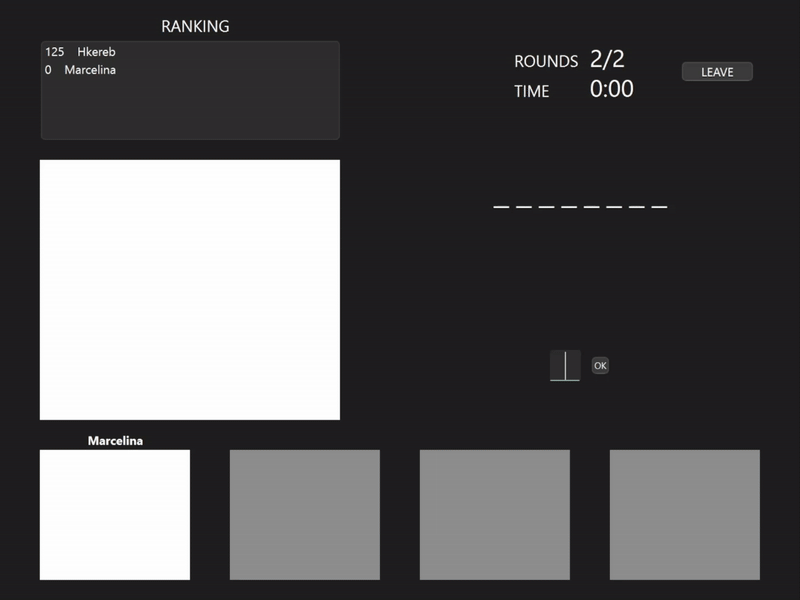
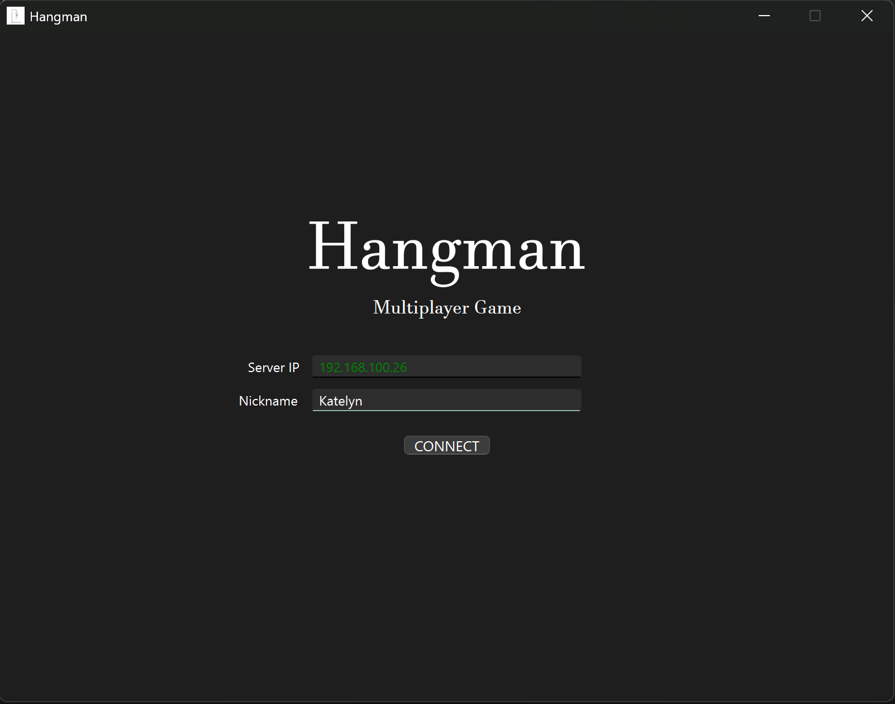
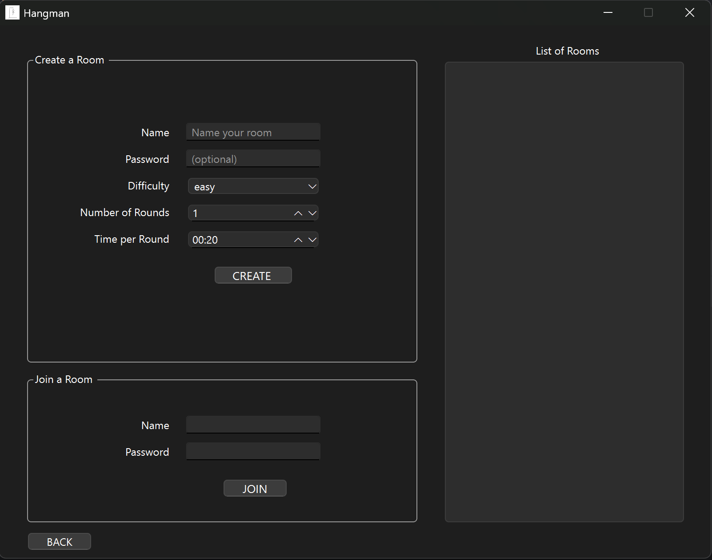
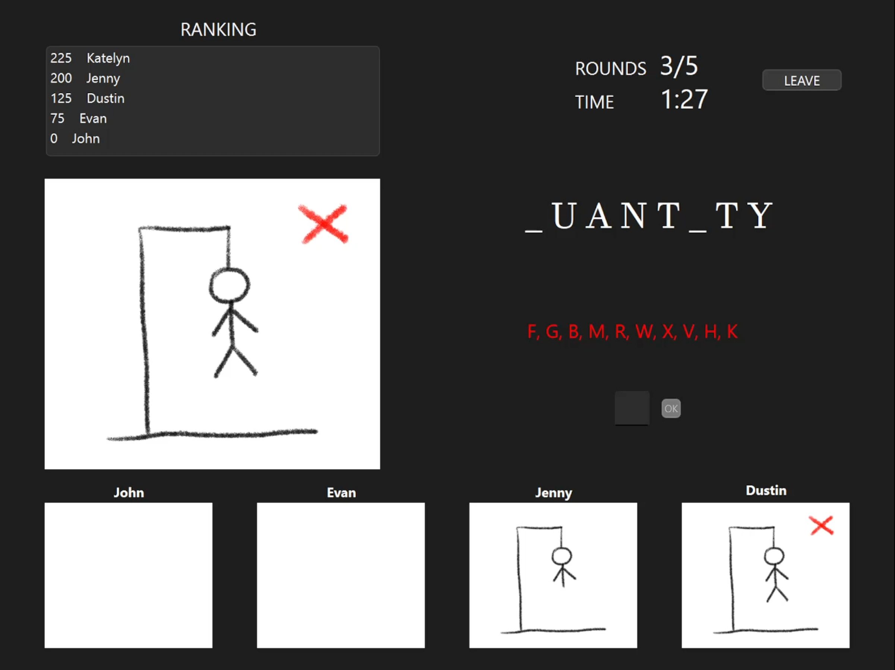
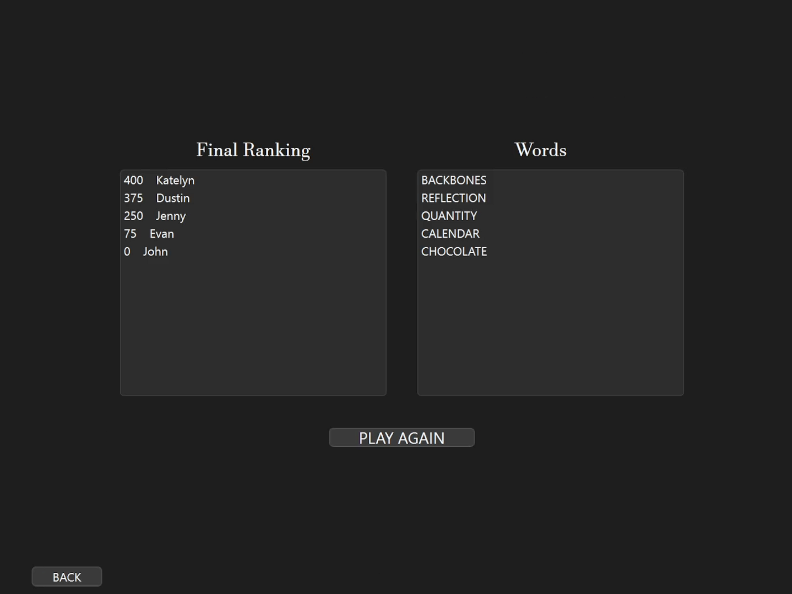

 


# 🎮 Hangman - Multiplayer Network Game

A twist on the classic word-guessing game, this version of Hangman is a real-time multiplayer game where players race each other to guess letters of a mutual secret word.

## 🚀 Features

- **Multiplayer gameplay** over LAN and the Internet
- **Lobby system** with currently available lobbies listed out
- **Customizable game settings** such as difficulty level, amount of rounds to be played and more
- **Scoring system** where players earn points for being the first person to guess a new letter
- **Real-time event handling** inlcuding network errors

## 📸 Demo
<div align="center">
    
</div>

<div align="center">
   
</div>

## 🛠️ Installation & Setup

### Prerequisites

For the **server** program to work, you need:

- **Linux OS**
- **C++ 17**
- **GCC / Clang / MSVC compiler**
- **CMake**

For the **client** program to work, you need:

- **Windows / Linux OS** (the client is tailored to Windows, but it is possible run it on Linux)
- **Python 3.9**
- **PySide6**

### STEP 1: Clone the Repository

```sh
git clone https://github.com/hkereb/hangman-sk2-2024.git
cd hangman-sk2-2024
```

### STEP 2: Build the Server

```sh
cd server
mkdir build && cd build
cmake ..
make
```

### STEP 3: Run the Server

```sh
./server
```

### STEP 4: Run the Client

```sh
cd ../../client
py main.py
```

## 🌍 Playing Over the Internet

1. **Find your public IP address** (you can use [WhatIsMyIP](https://www.whatismyip.com/))
2. **Configure Port Forwarding** on your router (forward the server port to your local machine)
3. **Allow traffic** through the firewall (open the required port)
4. **Share your public IP** with other players

## ❓ How It Works

## 👥 Contributors

- [Hanna Kerebińska](https://github.com/hkereb)
- [Vaccy](https://github.com/VacVaccy)
